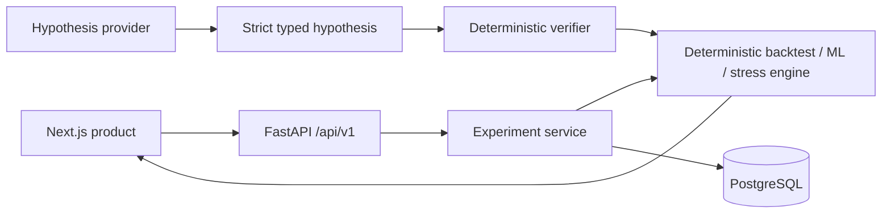
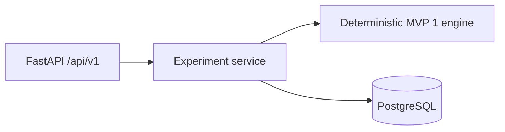

# Trading Strategy Red-Team Lab

Trading Strategy Red-Team Lab is a portfolio research product for testing where a systematic
strategy fails. AI proposes bounded failure hypotheses; a deterministic, transaction-cost-aware
Python engine owns every return, regime, stress result, and verdict. FastAPI/PostgreSQL preserve
experiments, while Next.js presents the evidence without a second calculation path.

It is research and adversarial-testing software only—not investment advice, brokerage execution,
or a strategy recommendation system.

**Existing live MVP 2 replay:** <https://strategy-redteam-lab.vercel.app/>. MVP 3 is locally
deployment-ready but has not replaced that production deployment in this gate. Public mode uses
only checked-in evidence and runs neither Python, paid models, nor credentials in the browser.

## Why this exists

LLMs are useful for adversarial prioritisation, but they should not own numerical market
calculations. The trust boundary is deliberate:

| LLM owns | Python owns |
| --- | --- |
| Bounded hypothesis text and proposed supported parameters | Schema/policy validation, scenario execution, backtesting, risk metrics, and verification verdicts |

## Architecture



## Verified result

The checked-in `ollama-run-024` evidence records one bounded `qwen3:4b` catalog-selection call.
Scenario `ollama-r01-c01` was a valid evaluation with three breaches, maximum normalized excess
of `1.1986`, and 81 chart points. The defender reproduced the result with replay delta `0.0`.
This is evidence of a configured stress-test failure, not a claim of trading alpha or profitability.

## Canonical historical portfolio case

The MVP 3 flagship case uses yfinance adjusted daily SPY/TLT observations from 2007-01-03 through
2025-12-31 (4,780 aligned rows), cached as immutable Parquet. The monthly 60/40 strategy uses the
same one-row execution lag and MVP 1 engine as CI; the benchmark is the engine's existing
equal-weight reference.

| Engine result | Actual value |
| --- | ---: |
| Gross / net total return | 357.89% / 354.81% |
| CAGR | 8.31% |
| Sharpe / Sortino | 0.768 / 0.997 |
| Annualized volatility | 11.22% |
| Maximum drawdown | 31.09% |
| Benchmark / excess return | 321.20% / 33.61% |
| Turnover / modeled cost | 6.767x / 0.677% |
| Walk-forward OOS return | 250.59% |

All four configured GMM components had meaningful post-training occupancy (559, 530, 101, and
722 observations), so the component count was not changed. The bounded 2x2 MVP 1 stress surface
did not produce terminal-return degradation on this historical path; that negative result remains
visible. Separate deterministic verification reproduced the three predefined AI-layer hypotheses:
positive stock/bond correlation, a volatility jump, and higher transaction costs.

Dataset SHA-256: `2c3d3b7bd8aede53ffd768e64db71532a48543c0e897e2aba1b4e8f67734426b`.

## Frontend product

The Next.js product provides Dashboard, Experiments, allowlisted New Experiment, flagship
Experiment Detail, Compare, and the preserved `/replay` workspace. Public mode renders checked-in
canonical evidence without Python, model credentials, or paid calls; an owner-controlled connected
mode uses only the typed `/api/v1` FastAPI endpoints.

## Technology

- Python 3.11, Pydantic v2, pandas/NumPy, pytest, Ruff, mypy, and Typer
- Ollama with `qwen3:4b` for the verified local catalog-selection run
- Optional Microsoft Foundry hosted-agent support
- Next.js 16, React 19, TypeScript, and pnpm

## Repository structure

```text
src/strategy_redteam/  deterministic engine, policies, providers, and replay services
tests/                 fixed, network-free acceptance fixtures and tests
config/                serialised experiment configuration
artifacts/demo/        verified demo telemetry source
frontend/              static, read-only verified-run dashboard
data/canonical/         immutable historical dataset and canonical MVP 3 product evidence
docs/                  specification, architecture, deployment, and status records
```

## Run locally

Use Python 3.11 for the backend. Create and activate a virtual environment, then install the
project with its development extras according to your platform's Python tooling.

```sh
python -m pytest -q
```

For the frontend:

```sh
cd frontend
pnpm install --frozen-lockfile
pnpm sync:fixture
pnpm test
pnpm lint
pnpm build
pnpm dev
```

The public default needs no environment. For an owner-controlled API deployment, set
`NEXT_PUBLIC_PRODUCT_MODE=connected` and `NEXT_PUBLIC_API_BASE_URL=http://localhost:8000`.

The verified local Ollama demo is an explicit manual action and requires a running local Ollama
server plus an experiment config whose provider is `ollama`:

```sh
redteam demo run --experiment config/demo_ollama_60_40.yaml --dataset tests/fixtures/offline-cache/manifests/correlation-break.json --output artifacts/demo/ollama-run-local
```

Choose a new output directory; completed artifact bundles are immutable.

## Reproducibility and safety

- Immutable data and configuration use SHA-256 provenance.
- The numerical engine is deterministic and records its seed.
- Rounds, candidates, scenarios, replays, model calls, and wall-clock time are bounded.
- Model-generated text is untrusted data: it is never executed as code, commands, paths, or URLs.
- Typed validation fails closed; invalid inputs are rejected rather than repaired.
- The defender independently reloads evidence and replays selected failures.
- Telemetry and artifacts preserve the hashes and verdicts needed to audit a result.

See [architecture](docs/ARCHITECTURE.md), [deployment](docs/DEPLOYMENT.md), and the frozen
[specification](docs/SPEC.md) for the detailed contracts.

## Quantitative research core (MVP 1)

The research helpers use chronological train/validation/test partitions and expanding
walk-forward windows only—financial observations are never randomly shuffled. Rolling regime
features are shifted one row, so each feature uses prior closes only. A seeded scikit-learn
`StandardScaler` and Gaussian mixture model are fitted on the training partition and then used
only for later inference. Numeric labels remain numeric; any narrative interpretation is separate.

Transaction costs are deducted from gross return on the effective trade date. Turnover is total
absolute traded notional; commission, bid/ask spread, and fixed slippage are each expressed in
basis points of that turnover, and their sum is the net-return deduction. The metrics helper
reports total return, CAGR, annualized volatility, Sharpe, Sortino, drawdown, Calmar, win rate,
profit factor, turnover, exposure, and trade summaries. Ratios that are mathematically undefined
(for example zero volatility or no losses) are emitted as `null`, never fabricated.

Available benchmarks are cash (zero return) and equal-weight buy-and-hold of the evaluated assets.
This is a research/evaluation platform, not investment advice: historical and synthetic stress
results do not predict future returns, and no market-impact, tax, borrow, or live-execution model
is included.

Run the canonical deterministic MVP 1 experiment (no network or model service is used):

```sh
redteam research run --experiment config/example_60_40.yaml --dataset tests/fixtures/offline-cache/manifests/correlation-break.json --output artifacts/mvp1-canonical
```

This produces `research-result.json`, containing immutable dataset provenance, gross and net
performance, cost components, benchmark comparison, temporal partitions, actual expanding-window
out-of-sample backtests, GMM metadata and numeric labels, regime summaries, and a 2×2 engine-backed
surface. Each grid point composes the existing volatility-multiplier and correlation-target stress
transforms and replays the real deterministic backtest; its stored correlation value is the shift
from the source-window correlation. The command defaults to 2 bp commission, 5 bp spread, and 3 bp
slippage per unit of turnover. Use a new output directory for each immutable result.

## Current status

- MVP 1 tagged `mvp1-quant-ml`
- MVP 2 tagged `mvp2-production-platform`
- MVP 3 implemented and locally acceptance-tested; deployment-ready, not automatically deployed
- Gate 13B complete
- Gate 14A complete
- Gate 14B public deployment verification complete
- MVP 1 tagged `mvp1-quant-ml`
- MVP 2 tagged `mvp2-production-platform`
- MVP 3 local product and acceptance evidence are recorded in `docs/STATUS.md`

## MVP 2 backend API

The optional production-style backend keeps the deterministic MVP 1 engine independent of HTTP
and PostgreSQL. FastAPI routes call an application service, which validates an existing immutable
manifest, runs the engine, and persists a compact lifecycle record plus the canonical typed result.



Start PostgreSQL and the backend locally with `docker compose up --build`. Swagger UI is at
`http://localhost:8000/docs`; OpenAPI JSON is at `/openapi.json`. For a non-container workflow,
set `DATABASE_URL` and run `alembic upgrade head`, then
`uvicorn strategy_redteam.api.app:app --reload`.

The API accepts a typed MVP 1 configuration and a manifest filename under `DATASET_ROOT` (default:
the fixed offline manifests directory), never an arbitrary client path. `POST /api/v1/experiments`
accepts an optional `idempotency_key`; retries with the same key return the original record.
`GET /health` is process health, and `GET /ready` verifies database connectivity.

Example shape (the `configuration` is the existing `config/example_60_40.yaml` content converted
to JSON):

```json
{"dataset_manifest":"correlation-break.json","idempotency_key":"demo-001","configuration":{"experiment_id":"offline-60-40-demo","seed":20260823,"...":"existing typed MVP 1 fields"}}
```

Retrieve metadata with `GET /api/v1/experiments/{id}` and the unchanged structured research
result with `GET /api/v1/experiments/{id}/result`. Schema migrations are authoritative:
`alembic upgrade head`; generate reviewed revisions with `alembic revision --autogenerate -m "..."`.
