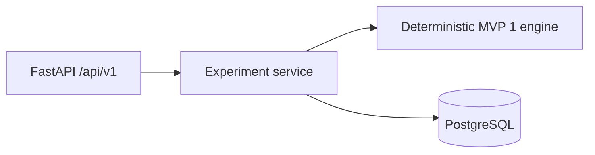

# Trading Strategy Red-Team Lab

Trading Strategy Red-Team Lab is a bounded adversarial evaluation platform: an LLM attacker
selects policy-valid market stresses, a deterministic Python engine evaluates a systematic
strategy, and an independent defender replays failures. It is research and evaluation software
only—never brokerage execution or investment advice.

**Live Demo — Verified Run Replay:** <https://strategy-redteam-lab.vercel.app/>. This public,
read-only application replays a verified telemetry artifact produced by the evaluation pipeline;
it is not a live trading system and runs neither Python nor Ollama publicly.

## Why this exists

LLMs are useful for adversarial prioritisation, but they should not own numerical market
calculations. The trust boundary is deliberate:

| LLM owns | Python owns |
| --- | --- |
| Attack selection and prioritisation | Scenario construction, numeric stress parameters, dates, IDs, policy validation, backtesting, risk metrics, and replay verification |

## Architecture

```mermaid
flowchart LR
  A[Immutable data and config] --> B[Deterministic candidate generation]
  B --> C[Policy validation]
  C --> D[Prevalidated AttackCatalog]
  D --> E[Ollama selects an attack key]
  E --> F[Deterministic stress and backtest]
  F --> G[Risk-limit breaches]
  G --> H[Independent defender replay]
  H --> I[Verified telemetry]
  I --> J[Next.js replay dashboard]
```



## Verified result

The checked-in `ollama-run-024` evidence records one bounded `qwen3:4b` catalog-selection call.
Scenario `ollama-r01-c01` was a valid evaluation with three breaches, maximum normalized excess
of `1.1986`, and 81 chart points. The defender reproduced the result with replay delta `0.0`.
This is evidence of a configured stress-test failure, not a claim of trading alpha or profitability.

## Frontend replay

The read-only Next.js dashboard renders baseline versus stressed equity, drawdown, the canonical
selected attack, breach events, defender replay, and provenance hashes. It builds from a
checked-in verified telemetry fixture; it does not require the Python backend, Ollama, model
credentials, or a user-specific path at runtime.

## Technology

- Python 3.11, Pydantic v2, pandas/NumPy, pytest, Ruff, mypy, and Typer
- Ollama with `qwen3:4b` for the verified local catalog-selection run
- Optional Microsoft Foundry hosted-agent support
- Next.js 16, React 19, TypeScript, and pnpm

## Repository structure

```text
src/strategy_redteam/  deterministic engine, policies, providers, and replay services
tests/                 fixed, network-free acceptance fixtures and tests
config/                serialised experiment configuration
artifacts/demo/        verified demo telemetry source
frontend/              static, read-only verified-run dashboard
docs/                  specification, architecture, deployment, and status records
```

## Run locally

Use Python 3.11 for the backend. Create and activate a virtual environment, then install the
project with its development extras according to your platform's Python tooling.

```sh
python -m pytest -q
```

For the frontend:

```sh
cd frontend
pnpm install --frozen-lockfile
pnpm sync:fixture
pnpm test
pnpm lint
pnpm build
pnpm dev
```

The verified local Ollama demo is an explicit manual action and requires a running local Ollama
server plus an experiment config whose provider is `ollama`:

```sh
redteam demo run --experiment config/demo_ollama_60_40.yaml --dataset tests/fixtures/offline-cache/manifests/correlation-break.json --output artifacts/demo/ollama-run-local
```

Choose a new output directory; completed artifact bundles are immutable.

## Reproducibility and safety

- Immutable data and configuration use SHA-256 provenance.
- The numerical engine is deterministic and records its seed.
- Rounds, candidates, scenarios, replays, model calls, and wall-clock time are bounded.
- Model-generated text is untrusted data: it is never executed as code, commands, paths, or URLs.
- Typed validation fails closed; invalid inputs are rejected rather than repaired.
- The defender independently reloads evidence and replays selected failures.
- Telemetry and artifacts preserve the hashes and verdicts needed to audit a result.

See [architecture](docs/ARCHITECTURE.md), [deployment](docs/DEPLOYMENT.md), and the frozen
[specification](docs/SPEC.md) for the detailed contracts.

## Quantitative research core (MVP 1)

The research helpers use chronological train/validation/test partitions and expanding
walk-forward windows only—financial observations are never randomly shuffled. Rolling regime
features are shifted one row, so each feature uses prior closes only. A seeded scikit-learn
`StandardScaler` and Gaussian mixture model are fitted on the training partition and then used
only for later inference. Numeric labels remain numeric; any narrative interpretation is separate.

Transaction costs are deducted from gross return on the effective trade date. Turnover is total
absolute traded notional; commission, bid/ask spread, and fixed slippage are each expressed in
basis points of that turnover, and their sum is the net-return deduction. The metrics helper
reports total return, CAGR, annualized volatility, Sharpe, Sortino, drawdown, Calmar, win rate,
profit factor, turnover, exposure, and trade summaries. Ratios that are mathematically undefined
(for example zero volatility or no losses) are emitted as `null`, never fabricated.

Available benchmarks are cash (zero return) and equal-weight buy-and-hold of the evaluated assets.
This is a research/evaluation platform, not investment advice: historical and synthetic stress
results do not predict future returns, and no market-impact, tax, borrow, or live-execution model
is included.

Run the canonical deterministic MVP 1 experiment (no network or model service is used):

```sh
redteam research run --experiment config/example_60_40.yaml --dataset tests/fixtures/offline-cache/manifests/correlation-break.json --output artifacts/mvp1-canonical
```

This produces `research-result.json`, containing immutable dataset provenance, gross and net
performance, cost components, benchmark comparison, temporal partitions, actual expanding-window
out-of-sample backtests, GMM metadata and numeric labels, regime summaries, and a 2×2 engine-backed
surface. Each grid point composes the existing volatility-multiplier and correlation-target stress
transforms and replays the real deterministic backtest; its stored correlation value is the shift
from the source-window correlation. The command defaults to 2 bp commission, 5 bp spread, and 3 bp
slippage per unit of turnover. Use a new output directory for each immutable result.

## Current status

- Gate 12E complete
- Gate 13A complete
- Gate 13B complete
- Gate 14A complete
- Gate 14B public deployment verification complete

## MVP 2 backend API

The optional production-style backend keeps the deterministic MVP 1 engine independent of HTTP
and PostgreSQL. FastAPI routes call an application service, which validates an existing immutable
manifest, runs the engine, and persists a compact lifecycle record plus the canonical typed result.



Start PostgreSQL and the backend locally with `docker compose up --build`. Swagger UI is at
`http://localhost:8000/docs`; OpenAPI JSON is at `/openapi.json`. For a non-container workflow,
set `DATABASE_URL` and run `alembic upgrade head`, then
`uvicorn strategy_redteam.api.app:app --reload`.

The API accepts a typed MVP 1 configuration and a manifest filename under `DATASET_ROOT` (default:
the fixed offline manifests directory), never an arbitrary client path. `POST /api/v1/experiments`
accepts an optional `idempotency_key`; retries with the same key return the original record.
`GET /health` is process health, and `GET /ready` verifies database connectivity.

Example shape (the `configuration` is the existing `config/example_60_40.yaml` content converted
to JSON):

```json
{"dataset_manifest":"correlation-break.json","idempotency_key":"demo-001","configuration":{"experiment_id":"offline-60-40-demo","seed":20260823,"...":"existing typed MVP 1 fields"}}
```

Retrieve metadata with `GET /api/v1/experiments/{id}` and the unchanged structured research
result with `GET /api/v1/experiments/{id}/result`. Schema migrations are authoritative:
`alembic upgrade head`; generate reviewed revisions with `alembic revision --autogenerate -m "..."`.
