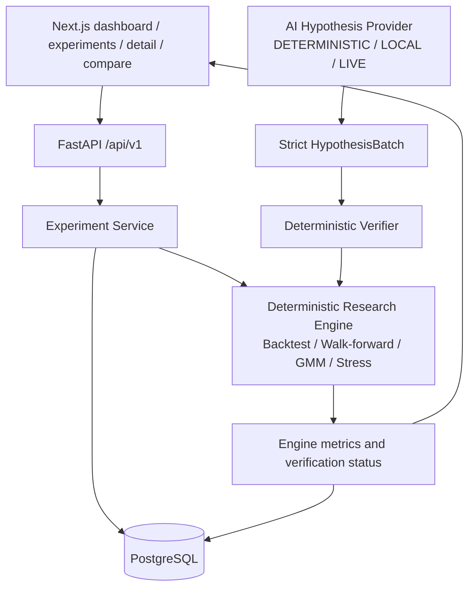

# Architecture and trust boundaries

## MVP 3 product architecture



The AI provider is outside the authoritative metric path. It can supply only schema-valid,
allowlisted stress parameters; it cannot set returns, risk metrics, or verification status.
Public mode loads a precomputed canonical artifact and exposes no provider key. Connected mode
uses FastAPI for every persisted experiment and comparison.

## System

The lab evaluates stress scenarios against a fixed systematic strategy. Immutable market data and
serialised configuration enter the deterministic Python engine. A provider can prioritise attacks,
but the engine validates and evaluates every scenario. The defender independently reloads the
evidence and reproduces up to the strongest failures. The frontend is a separate, read-only
rendering of verified telemetry.

## Trust boundaries

| Boundary | Allowed responsibility | Prohibited responsibility |
| --- | --- | --- |
| Model provider | Select or propose bounded, typed attack inputs; supply bounded narrative metadata | Calculate market metrics, set numerical stress values in the Ollama path, construct authoritative dates/IDs, mutate evidence, or execute text |
| Deterministic Python | Construct scenarios, validate policy and runtime admissibility, evaluate stresses and risk rules, rank results, and write provenance | Treat model output as executable instructions or silently repair invalid data |
| Defender | Reload hashes, replay canonical inputs, compare metrics/events, and issue a verdict | Substitute its own evidence or mark unreproduced output as verified |
| Next.js replay | Parse checked-in telemetry fail-closed and display verified evidence | Call a backend/model, calculate strategy metrics, or mutate artifacts |

All cross-component payloads are Pydantic models with forbidden unknown fields. Narrative text,
headlines, and model responses are untrusted data, never code, shell input, filesystem paths, URLs,
or tool instructions.

## Provider architecture

- **Deterministic provider:** produces fixed, application-owned proposals for network-free tests
  and offline evaluation.
- **Ollama:** the verified local path exposes only a prevalidated `AttackCatalog` and makes one
  JSON-mode, `think=False` catalog-key selection call for a valid proposal. Python resolves the
  selected key and owns scenario values and final IDs.
- **Microsoft Foundry:** optional typed hosted-agent clients support bounded proposal and narrative
  boundaries. Local execution constructs these dependencies lazily; the static frontend needs none.

## Boundedness

The active hard limits are `MAX_ROUNDS=3`, `MAX_CANDIDATES_PER_ROUND=8`,
`MAX_TOTAL_SCENARIOS=24`, and `TOP_K=3`. A configurable wall-clock timeout and a recorded seed
are required. The valid Ollama catalog-selection path makes one model call; the broader
orchestrator invokes attacker once and defender once. Date calculations are vectorised; iteration
is limited to the bounded scenario batch.

## Verification lifecycle

```text
Policy-valid attack selection
  -> deterministic evaluation
  -> recorded risk-limit breach
  -> defender reloads hashes and replays canonical inputs
  -> reproduced / not_reproduced / invalid_evidence verdict
  -> verified telemetry rendered by the read-only dashboard
```

Only a `reproduced` defender verdict supports a verified-failure claim. The frontend fixture is
synced byte-for-byte from `artifacts/demo/ollama-run-024/demo-telemetry.json` by
`frontend/scripts/sync-demo-telemetry.mjs`.
